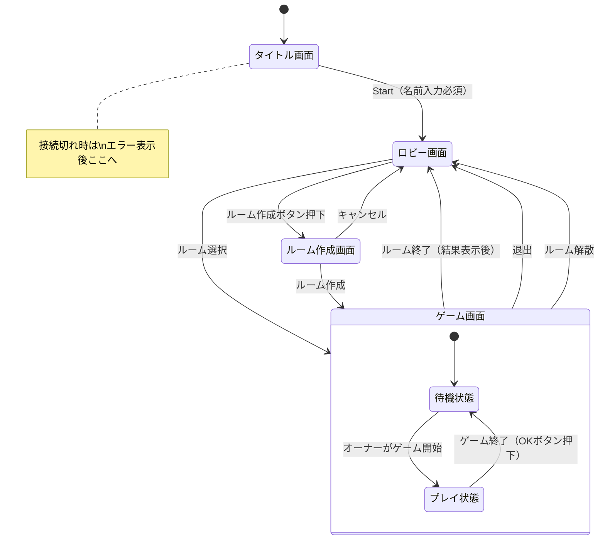

# 画面仕様書

オンライン UNO ゲーム「ドボン UNO」の画面遷移図および画面設計書。

---

## 1. 画面遷移図

### 遷移詳細

| 遷移元         | 遷移先         | トリガー                                        |
| -------------- | -------------- | ----------------------------------------------- |
| タイトル画面   | ロビー画面     | Start ボタン押下（名前入力必須）                |
| ロビー画面     | ルーム作成画面 | ルーム作成ボタン押下                            |
| ロビー画面     | ゲーム画面     | ルーム一覧からルーム選択                        |
| ルーム作成画面 | ゲーム画面     | 作成ボタン押下                                  |
| ルーム作成画面 | ロビー画面     | キャンセルボタン押下                            |
| ゲーム画面     | ロビー画面     | 退出ボタン押下                                  |
| ゲーム画面     | ロビー画面     | オーナーがルーム解散                            |
| ゲーム画面     | ロビー画面     | プレイヤーが 1 人になりルーム終了（結果表示後） |
| 任意の画面     | タイトル画面   | 接続切れ（エラーメッセージ表示後）              |

### ゲーム画面内の状態遷移

| 遷移元     | 遷移先     | トリガー                                    |
| ---------- | ---------- | ------------------------------------------- |
| 待機状態   | プレイ状態 | オーナーがゲーム開始（参加 ON が 2 人以上） |
| プレイ状態 | 待機状態   | ゲーム終了（OK ボタン押下）                 |

※ ゲーム画面は「待機状態」と「プレイ状態」を同一画面内で切り替える。詳細は [game-state.md](./game-state.md) を参照。

---

## 2. 画面設計

### 2.1 タイトル画面

ゲーム開始前にプレイヤー名を入力する画面。

#### UI 要素

| 要素           | 種類         | 説明                                     |
| -------------- | ------------ | ---------------------------------------- |
| ゲームタイトル | テキスト     | 「ドボン UNO」を表示                     |
| 名前入力欄     | テキスト入力 | プレイヤー名を入力（必須、最大 20 文字） |
| Start ボタン   | ボタン       | 名前入力後に有効化、ルーム選択画面へ     |

#### 状態

- 名前未入力時：Start ボタンは無効（disabled）
- 名前入力時：Start ボタンが有効化

---

### 2.2 ロビー画面

ルームを作成するか、既存のルームに参加するかを選択する画面。ルーム一覧も同時に表示される。

#### UI 要素

| 要素             | 種類     | 説明                         |
| ---------------- | -------- | ---------------------------- |
| プレイヤー名表示 | テキスト | 入力した名前を表示           |
| ルーム作成ボタン | ボタン   | ルーム作成画面へ遷移         |
| ルーム一覧       | リスト   | 各ルームをカード形式で表示   |
| ルームカード     | カード   | ルーム情報を表示（下記参照） |
| 更新ボタン       | ボタン   | ルーム一覧を再取得           |

#### ルームカードの内容

| 要素               | 種類     | 説明                                     |
| ------------------ | -------- | ---------------------------------------- |
| オーナー名         | テキスト | ルーム作成者の名前（大きく表示）         |
| 鍵アイコン         | アイコン | パスワード付きルームの場合のみ表示       |
| 参加プレイヤー一覧 | テキスト | 参加中のプレイヤー名をカンマ区切りで表示 |
| 人数表示           | テキスト | 現在人数 / 最大人数（例: 3/6）           |
| 状態バッジ         | バッジ   | 「待機中」または「プレイ中」             |
| 参加ボタン         | ボタン   | ルームに参加（空きがあれば有効）         |

#### 状態

- 待機中のルーム：参加ボタン有効
- プレイ中で空きありのルーム：参加ボタン有効（途中参加として待合室へ）
- プレイ中で満員のルーム：参加ボタン無効
- パスワード付きルーム：参加ボタン押下時にパスワード入力ダイアログを表示

---

### 2.3 ルーム作成画面

新しいルームを作成する画面。パスワードの有無を設定できる。

#### UI 要素

| 要素                 | 種類     | 説明                                           |
| -------------------- | -------- | ---------------------------------------------- |
| 画面タイトル         | テキスト | 「ルーム作成」を表示                           |
| パスワード設定トグル | トグル   | ON にすると 5 桁の数字パスワードが自動生成     |
| パスワード表示       | テキスト | 生成されたパスワードを表示（トグル ON 時のみ） |
| 作成ボタン           | ボタン   | ルーム待合室へ遷移                             |
| キャンセルボタン     | ボタン   | ロビー画面へ戻る                               |

#### 状態

- パスワード OFF：パスワードなしでルーム作成
- パスワード ON：5 桁の数字パスワードが自動生成され表示

---

### 2.4 ゲーム画面

ゲームをプレイする画面。待機状態とプレイ状態を同一画面内で切り替える。
途中参加プレイヤーもこの画面に合流する。

#### 画面状態

画面の状態一覧は [game-state.md](./game-state.md) を参照。

#### UI 要素（待機状態）

| 要素               | 種類       | 説明                                         |
| ------------------ | ---------- | -------------------------------------------- |
| ルーム情報         | テキスト   | ルーム ID                                    |
| 参加プレイヤー一覧 | リスト     | 参加中のプレイヤーを表示                     |
| プレイヤー項目     | リスト項目 | 名前、オーナーバッジ、参加状態を表示         |
| 次ゲーム参加トグル | トグル     | 次のゲームに参加するか選択（デフォルト: ON） |
| ゲーム開始ボタン   | ボタン     | オーナーのみ表示、参加 ON が 2 人以上で有効  |
| 退出ボタン         | ボタン     | ルームから退出                               |
| ルーム解散ボタン   | ボタン     | オーナーのみ表示、ルームを解散               |

#### プレイヤー項目の内容（待機状態）

| 要素           | 種類     | 説明                           |
| -------------- | -------- | ------------------------------ |
| プレイヤー名   | テキスト | プレイヤーの名前               |
| オーナーバッジ | バッジ   | オーナーの場合のみ表示         |
| 参加状態       | アイコン | 次ゲームに参加するか否かを表示 |

#### 待機状態の表示条件

- ゲーム中に途中参加した場合：観戦状態。
- 参加者が 1 人の場合：ゲーム開始ボタン無効

#### UI 要素（プレイ状態）

| 要素             | 種類         | 説明                                              |
| ---------------- | ------------ | ------------------------------------------------- |
| 他プレイヤー表示 | エリア       | 他プレイヤーの手札枚数・名前を表示（円形配置）    |
| 場札             | カード       | 最新の 1 枚（複数枚同時出しの場合は複数枚）を表示 |
| 山札             | カード       | 山札（残り枚数表示）                              |
| 自分の手札       | カードリスト | 自分の手札を表示（色順 → 数字順にソート）         |
| アクションエリア | エリア       | 状況に応じたアクションボタンを表示                |
| タイマー         | 表示         | 残り時間（10 秒）を表示（自分の手番のみ）         |
| 累積ドロー表示   | テキスト     | ドロー累積中の枚数を表示                          |
| 現在の色表示     | 表示         | 現在有効な色を常に表示                            |
| ターン表示       | テキスト     | 現在の手番プレイヤーを表示                        |
| 順番方向表示     | アイコン     | 時計回り/反時計回りを表示（2 人プレイ時も表示）   |
| スコアボード     | パネル       | 各プレイヤーの現在スコアを表示                    |
| レート表示       | テキスト     | 2 倍以上の場合のみ表示                            |
| 退出ボタン       | ボタン       | ゲーム中も退出可能（配置は実装時に決定）          |

#### レイアウト

- 自分の表示が手前、他プレイヤーは手番順に円形配置
- 場札は過去のカードは非表示

#### 手札のソート順

色順（赤 → 緑 → 青 → 黄 → ワイルド）、同色内は数字 → 記号カード → ドローカードの順。
例: r1, r2, g1, g2, g-skip, g-reverse, g-draw2, wild, draw4

#### 他プレイヤー表示の内容

| 要素         | 種類     | 説明                   |
| ------------ | -------- | ---------------------- |
| プレイヤー名 | テキスト | プレイヤーの名前       |
| 手札枚数     | テキスト | 残り手札の枚数         |
| 手番表示     | アイコン | 現在の手番なら強調表示 |

---

## 3. プレイヤーアクション一覧

ゲーム中にプレイヤーが実行可能なアクションの一覧。

### 3.1 通常アクション

| アクション   | 条件                           | UI 要素                       |
| ------------ | ------------------------------ | ----------------------------- |
| カードを出す | 自分の手番、出せるカードがある | 手札のカードをタップ/クリック |
| 山札を引く   | 自分の手番、ドロー累積中でない | 山札をタップ/クリック         |
| パスする     | 自分の手番、山札を引いた後     | パスボタン                    |

※ スマホやタブレットで、カードをタップすると選択状態になり、もう一度同じカードをタップするとカードが出される。ただし、重ね出しが可能な場合、カードは出されずに、何枚重ねて出すのかを選択する UI が表示され、それを選択するとカードが出される。
※ PC で、カードをクリックすると出される。
※ パスボタンは山札を引いた後のみ表示される。

### 3.2 色選択

| アクション | 条件                         | UI 要素                        |
| ---------- | ---------------------------- | ------------------------------ |
| 色を選択   | ワイルド/ドロー 4 を出した後 | 色選択パネル（赤・青・緑・黄） |

※ ワイルド/ドロー 4 を重ね出しした場合でも、色選択は 1 回のみ。

### 3.3 ドロー累積対応

| アクション         | 条件                                 | UI 要素                  |
| ------------------ | ------------------------------------ | ------------------------ |
| 累積分を引く       | ドロー累積中                         | 「○ 枚引く」ボタン       |
| ドローカードを出す | ドロー累積中、重ねられるカードがある | 手札のドローカードを出す |

※ 重ねられるカードがあっても「○ 枚引く」ボタンで引くことを選択可能。

### 3.4 カットイン

| アクション | 条件                                           | UI 要素                        |
| ---------- | ---------------------------------------------- | ------------------------------ |
| カットイン | 他プレイヤーの手番、全く同じカードを持っている | 手札のカードを出す（強調表示） |

※ 割り込み可能時は手札のカードが強調表示されるのみ（通知は表示されない）。

### 3.5 ドボン

| アクション   | 条件                             | UI 要素                         |
| ------------ | -------------------------------- | ------------------------------- |
| ドボンする   | 手札合計点が場のカード点数と一致 | ドボンボタン（通知と共に表示）  |
| ドボンしない | ドボン可能だが宣言しない         | ボタンを押さずに時間切れ/他操作 |

### 3.6 ドボン返し

| アクション       | 条件                                             | UI 要素                  |
| ---------------- | ------------------------------------------------ | ------------------------ |
| ドボン返しする   | ドボンされた、手札合計がドボン者の手札合計と一致 | ドボン返しボタン         |
| ドボン返ししない | ドボン返し可能だが宣言しない                     | ボタンを押さずに時間切れ |

---

## 4. アクションパネル/モーダル

ゲーム中に表示される特殊な UI。

### 4.1 アクションパネル（右下表示）

ゲーム画面が見えたまま、画面右下に表示されるアクション選択パネル。背景はグレーアウトしない。

#### 4.1.1 重ね出し選択パネル

同じカードを複数枚持っている状態で、そのうち 1 枚をタップした時に表示。

| 要素             | 種類     | 説明                                        |
| ---------------- | -------- | ------------------------------------------- |
| タイトル         | テキスト | 「何枚出しますか？」                        |
| 選択カード表示   | カード   | タップしたカードを表示                      |
| 枚数選択ボタン群 | ボタン群 | 1 枚、2 枚、...、N 枚（所持枚数分）のボタン |
| キャンセルボタン | ボタン   | カード選択をキャンセル                      |

※ キャンセル後は他のカードを選び直すことも、山札を引くことも可能。

#### 4.1.2 色選択パネル

ワイルド/ドロー 4 使用時に表示。

| 要素     | 種類     | 説明                     |
| -------- | -------- | ------------------------ |
| タイトル | テキスト | 「色を選択してください」 |
| 赤ボタン | ボタン   | 赤を選択                 |
| 青ボタン | ボタン   | 青を選択                 |
| 緑ボタン | ボタン   | 緑を選択                 |
| 黄ボタン | ボタン   | 黄を選択                 |

※ 他プレイヤーが割り込みした場合、パネルは自動的に閉じる。

#### 4.1.3 ドボンパネル

ドボン可能な状況で表示。

| 要素           | 種類     | 説明                 |
| -------------- | -------- | -------------------- |
| 通知メッセージ | テキスト | 「ドボンできます！」 |
| ドボンボタン   | ボタン   | ドボンを宣言         |
| 残り時間       | 表示     | 宣言可能な残り時間   |

#### 4.1.4 ドボン返しパネル

ドボン返し可能な状況で表示。

| 要素             | 種類     | 説明                     |
| ---------------- | -------- | ------------------------ |
| 通知メッセージ   | テキスト | 「ドボン返しできます！」 |
| ドボン返しボタン | ボタン   | ドボン返しを宣言         |
| 残り時間         | 表示     | 宣言可能な残り時間       |

※ 複数人からドボンされた場合でもボタンは 1 つ。押すと条件を満たす全員に対してドボン返しが成立する。

---

### 4.2 モーダル/ダイアログ

背景がグレーアウトし、操作を求める UI。

#### 4.2.1 パスワード入力ダイアログ

パスワード付きルームに参加する際に表示。

| 要素             | 種類         | 説明                     |
| ---------------- | ------------ | ------------------------ |
| タイトル         | テキスト     | 「パスワードを入力」     |
| パスワード入力欄 | テキスト入力 | 5 桁の数字を入力         |
| 参加ボタン       | ボタン       | パスワード入力後に有効化 |
| キャンセルボタン | ボタン       | ダイアログを閉じる       |
| エラーメッセージ | テキスト     | パスワード不一致時に表示 |

#### 4.2.2 ゲーム結果モーダル

ゲーム終了時に表示（山札切れ時、プレイヤー 1 人時も表示）。

| 要素           | 種類     | 説明                                 |
| -------------- | -------- | ------------------------------------ |
| スコアテーブル | テーブル | 各プレイヤーのスコア履歴と収支を表示 |
| OK ボタン      | ボタン   | 押すと待合室へ自動遷移               |

#### スコアテーブルの構成

| 構成要素   | 説明                               |
| ---------- | ---------------------------------- |
| 列         | 各プレイヤー名                     |
| 行（履歴） | 各ゲームの変動ポイント（+/- 表示） |
| 行（収支） | 一番下の行に累計収支を表示         |

#### 表示フロー

1. モーダル表示時、収支は**集計前**の値を表示
2. 今回のゲームの変動ポイントがアニメーションで反映され、収支が更新される
3. OK ボタンを押すと待機状態へ遷移

#### 4.2.3 退出確認ダイアログ

プレイ状態で退出ボタン押下時に表示（待機状態では確認なしで退出）。

| 要素           | 種類     | 説明                         |
| -------------- | -------- | ---------------------------- |
| 確認メッセージ | テキスト | 「ルームから退出しますか？」 |
| はいボタン     | ボタン   | 退出を実行                   |
| いいえボタン   | ボタン   | キャンセル                   |

#### 4.2.4 ルーム解散確認ダイアログ

オーナーがルーム解散ボタン押下時に表示。

| 要素           | 種類     | 説明                       |
| -------------- | -------- | -------------------------- |
| 確認メッセージ | テキスト | 「ルームを解散しますか？」 |
| はいボタン     | ボタン   | 解散を実行                 |
| いいえボタン   | ボタン   | キャンセル                 |

---

## 5. 通知/トースト

画面右上に一時的に表示されるメッセージ。3 秒で自動的に閉じる。
複数の通知が同時に発生した場合はキューイング（順番に表示）。実装は UI ライブラリに委ねる。

| 通知種類       | 表示タイミング               | メッセージ例                      |
| -------------- | ---------------------------- | --------------------------------- |
| プレイヤー参加 | 他プレイヤーがルームに参加   | 「○○ さんが参加しました」         |
| プレイヤー退出 | 他プレイヤーがルームを退出   | 「○○ さんが退出しました」         |
| オーナー変更   | オーナーが退出して権限移譲   | 「○○ さんがオーナーになりました」 |
| ドボン発生     | 誰かがドボンを宣言           | 「○○ さんがドボン！」             |
| ドボン返し発生 | 誰かがドボン返しを宣言       | 「○○ さんがドボン返し！」         |
| 割り込み発生   | 誰かが割り込みをした         | 「○○ さんが割り込み！」           |
| レート変更     | 山札切れでレートが変わった時 | 「レート ○ 倍に上昇！」           |
| 接続切れ       | 他プレイヤーの接続が切れた時 | 「○○ さんの接続が切れました」     |

---

## 6. 画面全体演出

ゲームイベント発生時に画面全体に表示される演出。シンプルな表示とし、自動的に消える。

| 演出種類     | 表示タイミング                 | 内容                           | 表示時間 |
| ------------ | ------------------------------ | ------------------------------ | -------- |
| ゲーム開始   | オーナーがゲーム開始を押した後 | 3 秒のカウントダウン演出       | 3 秒     |
| 上がり       | プレイヤーが上がった時         | 上がったプレイヤー名を表示     | 約 1 秒  |
| スキップ効果 | スキップカードが出された時     | スキップ演出                   | 約 1 秒  |
| リバース効果 | リバースカードが出された時     | リバース演出（方向転換を表現） | 約 1 秒  |
| 色選択結果   | 色が選択された時               | 選択された色を画面全体に表示   | 約 1 秒  |

---

## 7. エラー表示

### 7.1 接続切れエラー

接続が切れた本人に表示。

| 要素             | 種類     | 説明                     |
| ---------------- | -------- | ------------------------ |
| エラーメッセージ | テキスト | 「接続が切れました」     |
| OK ボタン        | ボタン   | 押すとタイトル画面へ遷移 |
